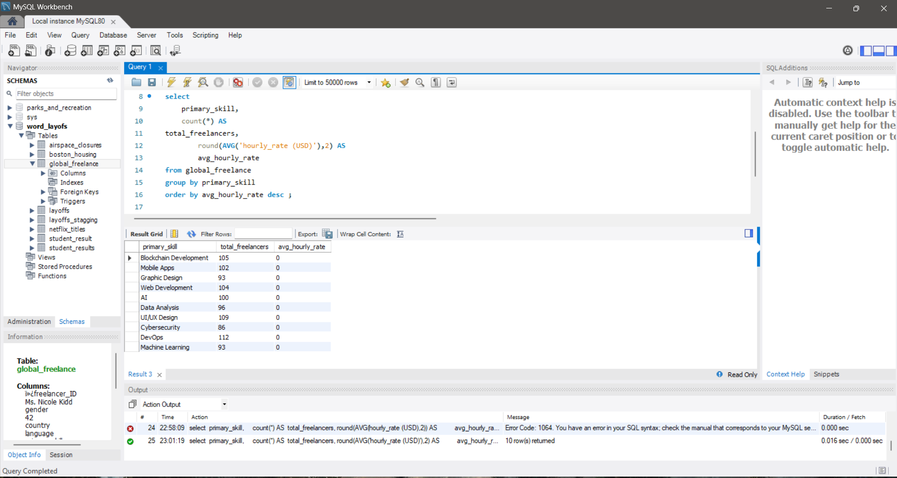
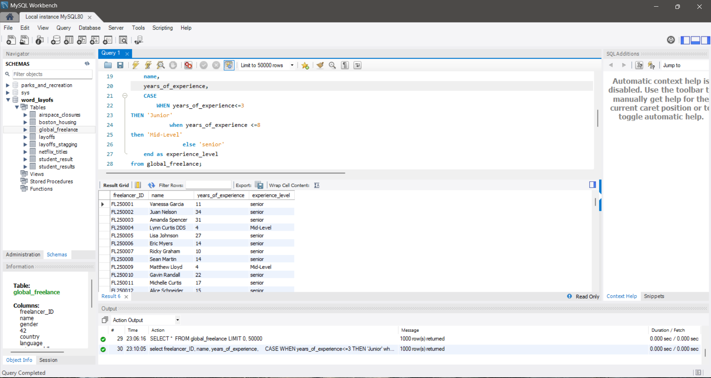
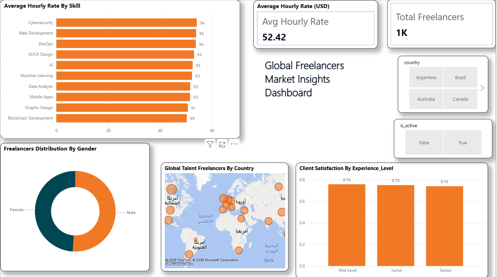
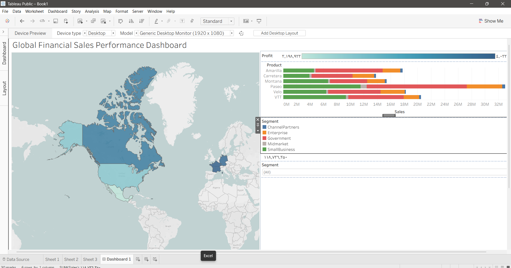

# 🖥️ SQL, Power BI & Tableau Data Analytics Portfolio

Welcome to my comprehensive Data Analytics portfolio! This repository serves as a centralized hub showcasing my expertise in database querying, data modeling, and business intelligence, featuring advanced projects developed using SQL, Power BI, and Tableau.

---

## 🛠️ Technical Capabilities
* **Database Management:** MySQL Server, MySQL Workbench
* **Business Intelligence (BI):** Power BI Desktop (DAX, Data Modeling), Tableau Public (Interactive Dashboards, Data Storytelling)

---

## 🚀 Featured Projects

### 1️⃣ Video Game Sales Performance Dashboard (Tableau) 🎮
Video Game Sales Performance Dashboard (Tableau)
​ Project Overview
​This project features an interactive and dynamic data visualization dashboard built using Tableau to uncover historical market trends, consumer behavior, and platform dominance within the global gaming industry. By transforming raw historical sales data into actionable, high-level business insights, this dashboard provides a comprehensive look at how different gaming eras, genres, and regional preferences shape the global market.

 Data Pipeline & Methodology
​To ensure data integrity and deliver a polished final presentation, the project followed a structured data analytics workflow:
​Data Cleaning & Preprocessing: Handled missing values, removed duplicates, and standardized platform/genre naming conventions to ensure consistency across the dataset.
​Data Normalization: Structured the dataset to enable fair, proportional comparisons across different historical eras and geographic territories.
​Dashboard Architecture: Designed an intuitive, user-friendly Tableau interface equipped with dynamic filters, allowing stakeholders to easily segment data by platform, genre, or region.

​🔍 Key Analytical Insights
​Genre Market Share: Action and Sports genres distinctively command the highest global market share, establishing themselves as the safest and most lucrative genres historically.
​Console Lifecycles & Dominance: Visualized the rise and fall of various console generations, highlighting the legendary, sustained market dominance of platforms like the PS2 and Xbox 360.
​Regional Consumer Divergence: Conducted a comparative analysis between North America (NA) and Japan (JP) sales trends. The data revealed sharp cultural differences in gaming preferences (e.g., Japan’s strong inclination toward specific genres/handhelds compared to North America's preference for home consoles and mainstream action titles).

​📉 Dashboard Breakdown & Visual Components
​The dashboard is meticulously organized into four key visual components that work cohesively:
​Top Performing Platforms: A comprehensive bar chart ranking the highest-grossing gaming hardware of all time.
​Top 10 Video Games Globally: A detailed breakdown of the individual gaming titles that achieved the highest global sales.
​NA vs. JP Sales Trends: A dual-axis comparative visualization mapping out regional market preferences side-by-side.
​Global Sales By Genre: A volume-based chart illustrating the total revenue distribution across different game categories.
* **Project Preview:** 

---

### 2️⃣ Boston Housing Market Analysis (SQL & Power BI) 🏙️
* **Objective:** To conduct a multi-dimensional analysis of housing factors and market valuation.
* **Process:** Used SQL to segment property categories based on median values and performed correlation analysis on socio-economic variables. The results were then transformed into a high-impact Power BI dashboard.
* **Outcome:** Enabled clear identification of "Expensive" vs. "Affordable" zones, providing actionable intelligence for potential investors.
* **SQL Script:** `boston_analysis_queries.sql`
* **Project Previews:** * 
    * 

---

### 3️⃣ Sales & Profit Performance Dashboard (Power BI) 📈
​📌 Project Overview
​This project delivers a comprehensive corporate business intelligence solution designed to serve as a single source of truth for monitoring and evaluating financial and operational performance. Built using Power BI, the dashboard translates complex corporate transactional records into dynamic financial insights, enabling executive stakeholders and financial analysts to monitor revenue streams, tracking profitability, and optimize regional budgets efficiently.

​🛠️ Technical Implementation & DAX Modeling
​The core power of this dashboard lies in its robust data modeling and advanced calculations, moving far beyond basic visual aggregations:
​Advanced DAX Calculations: Developed complex, optimized DAX measures to compute critical financial metrics including Year-over-Year (YoY) growth, net profit margins, time-intelligence patterns, and moving averages.
​Dynamic UI/UX Architecture: Designed a user-centric navigation layout featuring interactive slicers (e.g., product filters  advanced tooltips, and drill-through capabilities that allow users to seamlessly transition from macro corporate summaries to micro transaction-level details.
​Granular Performance Tracking: Structured data views to analyze temporal trends across daily and weekly intervals, capturing seasonal spikes and granular business operational rhythms.

​🔍 Key Business & Financial Insights
​The analytical architecture of the dashboard empowers organizations with crucial operational visibility:
​Corporate KPIs in Real-Time: Stakeholders can immediately evaluate high-level business health via core metrics like Total Sales, Net Profit, and Sum of Units Sold (exceeding 3,000+ units as highlighted in the data matrix).
​Customer & Product Profitability Mapping: Isolates top-performing B2B accounts (such as Uncle Joe's Prep Shop and Apocalypse Preppers United) alongside individual inventory performance (tracking high-volume products like Duct Tape, Multitool Survival Knives, and Nylon Ropes).
​Agile Budgeting & Allocation: By giving an unfiltered look into product margins and volume velocity, the system directly enables leadership to make faster, data-backed decisions regarding regional resource distribution and supply chain investments.

​📉 Dashboard Breakdown & UI Components
​As visualized the report interface features structured telemetry tiles:
​KPI Card Callouts: Highlighted metrics showcasing the absolute volume of products moving through the pipeline (e.g., Sum of Units Sold).
​Customer Performance Matrix: Comparative tables correlating individual customer accounts with total transaction volumes and Net Profit margins.
​Product Velocity Matrix: Deep-dive inventory grid sorting exact item names against Total Quantity ordered to evaluate product demand.
​Temporal Trend Analysis (Daily/Weekly Sales): High-density column charts mapping out revenue flow day-by-day across the calendar month to spot operational anomalies or peak cycles.
​Multi-Dimensional Slicers: Right-aligned product and category filters allowing instant report-wide context filtering.
* **Dashboard File:** `Sales & Profit Performance Dashboard.pbix`
* **Project Preview:** 

---

### 4️⃣ Zomato vs. Swiggy Food Delivery Analysis (Power BI) 🛒
* **Objective:** A competitive benchmarking analysis to understand market share and operational efficiency in the food delivery sector.
* **Process:** Cleaned large datasets to compare order frequency, platform preference, and customer satisfaction metrics across multiple geographic clusters.
* **Outcome:** Delivered a comparative dashboard that highlighted key growth opportunities in emerging markets for the competing platforms.
* **Dashboard File:** `Zomato-vs-Swiggy-Analysis.pbix`
* **Project Preview:** 

---

### 5️⃣ Global Airspace Connectivity & Risk Analysis 2026 (Tableau) ✈️
* **Objective:** To model and visualize the impact of geopolitical instability on global aviation corridors.
* **Process:** Aggregated flight disruption data using SQL and visualized the spatial-temporal effects of airspace closures. Created dynamic risk clusters to categorize regional threats.
* **Outcome:** Provided strategic insights into route resilience and flight volume volatility, essential for aviation risk management.
* **Project Preview:** 

**SQL Analytics Showcase:** Deep data exploration was performed using SQL to quantify the impact of airspace closures:
* **Total Flights Impacted:**
    ```sql
    SELECT SUM(flights_affected) AS total_flights_impacted 
    FROM airspace_closures;
    ```
* **High-Risk Zones:**
    ```sql
    SELECT country, COUNT(*) AS total_closures 
    FROM airspace_closures 
    GROUP BY country 
    ORDER BY total_closures DESC;
    ```
* **Regional Risk:**
    ```sql
    SELECT region, AVG(duration_hours) AS avg_duration 
    FROM airspace_closures 
    GROUP BY region 
    ORDER BY avg_duration DESC;
    ```
* **SQL Analysis Previews:**
    * 
    * 
    * 

---

### 6️⃣ Global Freelancers SQL Data Cleaning & Analysis 🌍
* **📌 Project Overview:** This project focuses on database refactoring, data cleaning, and business analysis using **SQL (MySQL)**. The dataset contained multiple formatting, encoding (BOM), and schema errors, which I resolved to build a clean analytical foundation.
* **🛠️ Tech Stack:** MySQL / MySQL Workbench.
* **🧼 Database Refactoring & Cleaning Steps:**
  * **Fixing Schema & Column Names:** Used `ALTER TABLE ... CHANGE COLUMN` to resolve broken headers caused by CSV import artifacts.
  * **Handling BOM Encoding:** Cleared hidden character encodings (e.g., ``) from primary keys (`freelancer_id`) to ensure database integrity and constraint compliance.
  * **Data Type Casting:** Standardized numerical values and percentages to ensure accurate mathematical calculations.
* **📊 Analytical Insights:**
  * **Market Rate Analysis:** Calculated average hourly rates and freelancer distribution grouped by `primary_skill`.
  * **Talent Metrics:** Aggregated top-tier countries by freelancer count.
  * **Performance Mapping:** Analyzed the relationship between experience levels and client satisfaction scores.
* **📸 Project Previews:**




---
---

---

### 7️⃣ Global Freelancers Market Insights Dashboard (Power BI) 📊
* **📌 Project Overview:** This is an interactive Power BI dashboard designed to visualize the global freelance market. It provides a comprehensive view of pricing structures, demographic distributions, and client satisfaction benchmarks.
* **✨ Key Analytical Features:**
    * **Unified Executive View:** Developed high-impact KPI metrics providing real-time visibility into the total talent pool (1,000+ freelancers) and average hourly rates ($52.42).
    * **Tech Domain Profitability Analysis:** Utilized a matrix to compare profitability across sectors like Cybersecurity and Web Development.
    * **Geospatial & Demographic Intelligence:** Integrated interactive mapping and donut charts to analyze workforce diversity and regional footprints.
    * **Experience vs. Satisfaction Correlation:** Implemented bivariate analysis to reveal insights into how expertise levels influence service quality.
* **🛠️ Technical Workflow:** Data modeling, DAX measure development, and UX design.
* **📸 Project Preview:** 


📊 End-to-End Financial Sales Dashboard 🚀

​A streamlined, multi-tool data pipeline project demonstrating the journey of raw financial data—from initial engineering to relational database management and premium interactive BI visualization.

​🛠️ Tech Stack
​Excel: Data Cleaning, Parsing, & Logical Feature Engineering 🧪
​MySQL: Relational Warehousing, SQL Cleaning Scripts, & Advanced Query Aggregations 💾
​Tableau: High-Impact Executive Dashboards & Dark Mode Mapping 🎨
​🚀 Project Workflow

​1. Data Cleaning & Architecture (Excel) 🧼
​Parsing: Restructured messy string configurations into structured columns.
​Feature Engineering: Built nested logical controls to dynamically classify transaction bounds into Small, Medium, or Large tiers.
​Financial Modeling: Engineered custom margin calculations for accurate bottom-line tracking.
​
2. Database Warehousing & Pipelines (MySQL) ⚙️
​Staging: Imported data as TEXT to completely bypass strict layout truncation errors.
​SQL Cleaning: Authored optimized REPLACE scripts to strip currency symbols and permanently altered metadata columns to numeric DOUBLE formats.
​Analytics: Executed complex queries utilizing conditional logic (CASE WHEN) and group filtering via HAVING.
​
3. Executive Business Intelligence (Tableau) 💎
​Premium UX/UI: Designed an interactive dashboard utilizing a clean, modern desktop layout.
​Advanced Visuals: Implemented an interactive global map sheet driven by profit density colors.
​Tooltip-in-Tooltip: Embedded a secondary dynamic Bar Chart inside the map's hover tooltips to show localized product performance instantly on hover.
​Slicers: Added synchronized, compact drop-down filters (Year, Segment) for smooth slicing.
​📊 Quick Executive Insights
​📈 The Volume Engine: The Government sector is the highest volume driver, showing massive traction with the Paseo product line.
​🌍 Global Balance: Net profits are highly balanced across international borders, with France and Germany holding a marginal competitive edge.
​⚠️ Product Health: While Paseo dominates, Carretera shows consistent stagnation, signaling a need for pricing or marketing adjustments.


* **📸 Project Preview:**
* 
  


## 💻 Sample SQL Architecture (Boston Project)

```sql
/* Segmenting houses based on median value (MEDV) */
SELECT 
    CASE 
        WHEN MEDV < 20 THEN 'Cheap'
        WHEN MEDV BETWEEN 20 AND 35 THEN 'Medium'
        ELSE 'Expensive'
    END AS House_Category,
    COUNT(*) AS Number_of_Houses
FROM boston_housing
GROUP BY House_Category;
