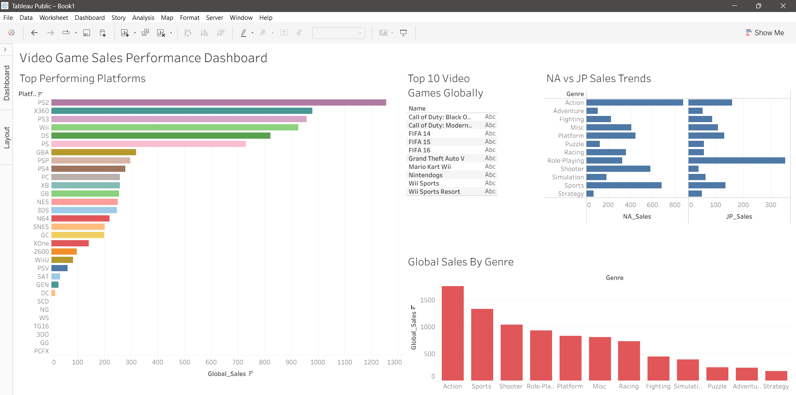
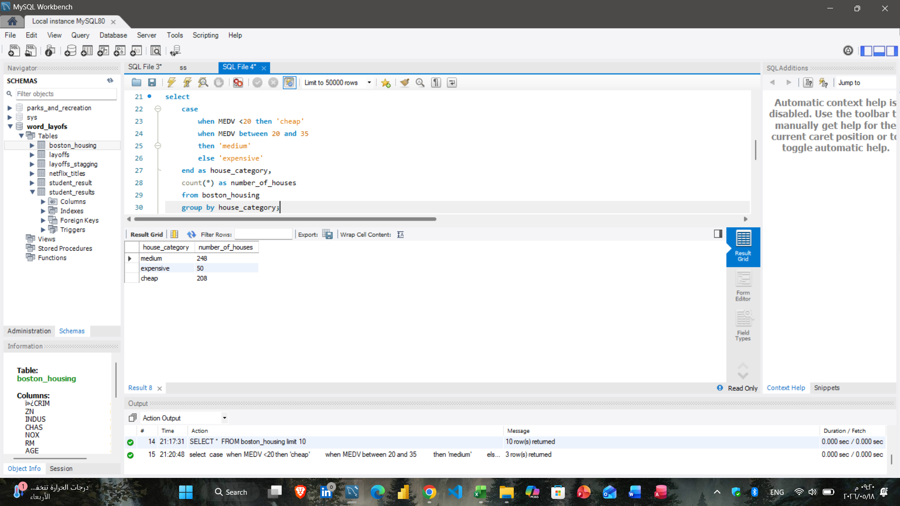
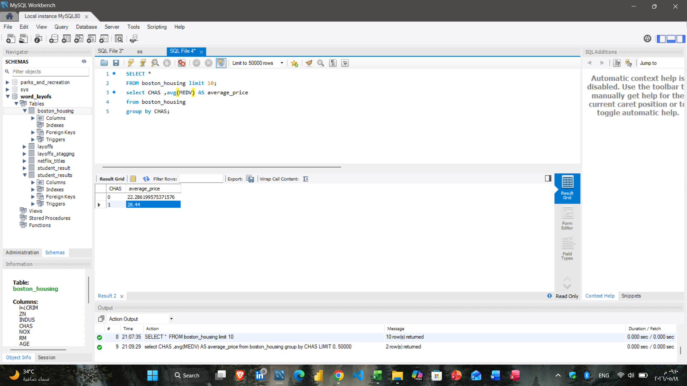
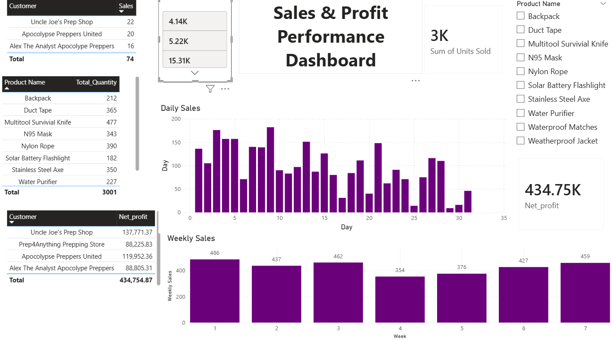
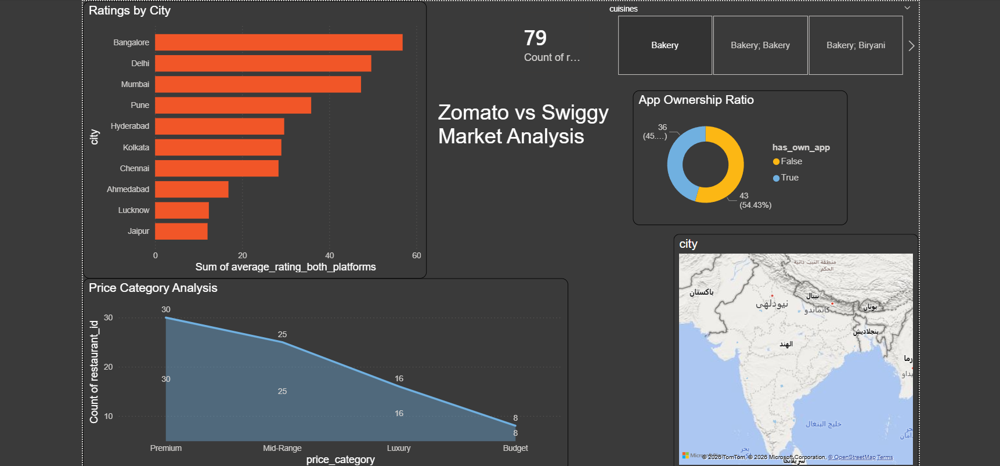
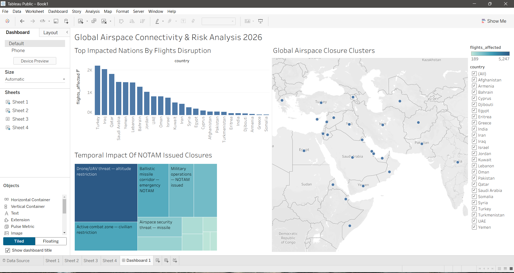
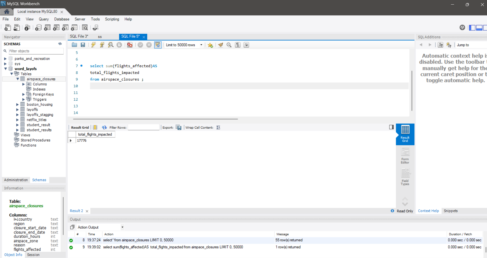
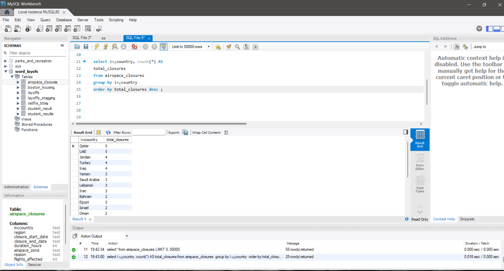
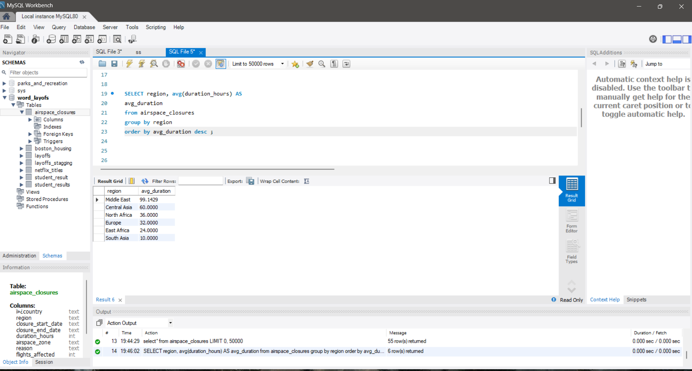

# 🖥️ SQL, Power BI & Tableau Data Analytics Portfolio
## معرض مشاريع قواعد البيانات ولوحات التحكم التفاعلية الشامل (BI & SQL)

Welcome to my comprehensive Data Analytics portfolio! This repository serves as a centralized hub showcasing my advanced capability to handle database querying, data modeling, and business intelligence across leading platforms like Power BI and Tableau.

مرحباً بكم في معرض مشاريعي الشامل لتحليل البيانات! يجمع هذا المستودع المطور بين مهاراتي في إدارة واستعلام قواعد البيانات باستخدام لغة SQL وبناء لوحات التحكم الديناميكية التفاعلية عبر برنامجي Power BI و Tableau لاستخراج مؤشرات الأداء ودعم اتخاذ القرار.

---

## 🛠️ Technical Capabilities | الأدوات والتقنيات
* **Database Management:** MySQL Server / MySQL Workbench
* **Business Intelligence (BI):** Power BI Desktop & Tableau Public (Interactive Design, DAX, Data Visualizations)

---

## 🚀 Featured Projects | المشاريع المرفوعة

### 1️⃣ Video Game Sales Performance Dashboard (Tableau) 🎮
* **📌 Project Overview | عن المشروع:**
  * **English:** A dynamic Tableau dashboard analyzing global video game sales across different platforms, genres, and regions (NA vs JP). It tracks industry trends and identifies top-performing gaming ecosystems.
  * **عربي:** لوحة تحكم تفاعلية متطورة صممتها باستخدام برنامج Tableau لتحليل مبيعات الألعاب الإلكترونية عالمياً. تتبع اللوحة أداء منصات الألعاب المختلفة، مبيعات فئات الألعاب، ومقارنة اتجاهات السوق بين أمريكا الشمالية واليابان.
* **📊 Key Insights Extracted | أهم الرؤى:**
  * Action and Sports genres dominate absolute global sales volume.
  * ألعاب الأكشن والرياضة تستحوذ على الحصة الأكبر من حجم المبيعات الإجمالي عالمياً.
  * PS2 and X360 remain the historic kings of platforms in total sales volume.
  * منصات مثل PS2 و X360 تصدرت تاريخياً إجمالي حجم المبيعات للمنصات.
* **📸 Project Preview | معاينة المشروع:**


---

### 2️⃣ Boston Housing Market Analysis (SQL & Power BI) 🏙️
* **📌 Project Overview | عن المشروع:**
  * **English:** Advanced data analysis on the Boston Housing dataset using SQL for deep querying and market segmentation, then visualizing the insights in Power BI.
  * **عربي:** مشروع تحليل متكامل لسوق العقارات في بوسطن. استخدمت استعلامات SQL متقدمة لتصنيف فئات السوق، وصممت لوحة تحكم تفاعلية بثيم غامق في Power BI.
* **💻 SQL Script File:** `boston_analysis_queries.sql`
* **📸 Project Previews | معاينة المشروع:**



---

### 3️⃣ Sales & Profit Performance Dashboard (Power BI) 📈
* **📌 Project Overview | عن المشروع:**
  * **English:** An enterprise commercial dashboard designed to track corporate financial health, analyze multi-regional revenue streams, and monitor profit growth margins dynamically.
  * **عربي:** لوحة تحكم تجارية متكاملة على مستوى الشركات لمراقبة الأداء المالي، تتبع حجم المبيعات الإجمالية وحساب نسب تحقيق المستهدفات وهوامش الأرباح بشكل تفاعلي مرن.
* **📊 Dashboard Source File:** `Sales & Profit Performance Dashboard.pbix`
* **📸 Project Preview | معاينة المشروع:**


---

### 4️⃣ Zomato vs Swiggy Food Delivery Analysis (Power BI) 🛒
* **📌 Project Overview | عن المشروع:**
  * **English:** A comparative analysis evaluating the sales performance, market share, and geographic distribution of order volumes between two major food delivery platforms.
  * **عربي:** مشروع تحليل ومقارنة أداء المبيعات وسلوك المستهلكين والحصة السوقية لأكبر منصتين في قطاع توصيل الطعام (Zomato و Swiggy) لمعرفة المناطق الأكثر تحقيقاً للأرباح.
* **📊 Dashboard Source File:** `Zomato-vs-Swiggy-Analysis.pbix`
* **📸 Project Preview | معاينة المشروع:**



### 5️⃣  Global Airspace Connectivity & Risk Analysis 2026 (Tableau) ✈️
* **📌 Project Overview | عن المشروع:**
  * **English:** A sophisticated Tableau dashboard analyzing global airspace disruption and risk clusters. It maps NOTAM-issued closures, impacts on flight volume, and temporal threats, providing a strategic view of geopolitical impacts on aviation.
  * **عربي:** لوحة تحكم متطورة باستخدام Tableau لتحليل اضطرابات المجال الجوي العالمي ومخاطر الطيران. المشروع يرسم خرائط إغلاق المجالات الجوية، ويوضح الأثر الكمي على عدد الرحلات الجوية، ويحلل التهديدات الأمنية والجيوسياسية بمرور الوقت.
* **📸 Project Preview | معاينة المشروع:**


**💻 SQL Analytics Showcase:** I performed deep data exploration using SQL to quantify the impact of airspace closures:
  - **Total Flights Impacted:**
    ```sql
    SELECT SUM(flights_affected) AS total_flights_impacted FROM airspace_closures;
    ```
  - **High-Risk Zones:**
    ```sql
    SELECT country, COUNT(*) AS total_closures FROM airspace_closures GROUP BY country ORDER BY total_closures DESC;
    ```
  - **Regional Risk:**
    ```sql
    SELECT region, AVG(duration_hours) AS avg_duration FROM airspace_closures GROUP BY region ORDER BY avg_duration DESC;
    ```
* **📸 Project Preview:**





---

---

## 💻 Sample SQL Architecture Used (Boston Project)

```sql
SELECT 
    CASE 
        WHEN MEDV < 20 THEN 'Cheap'
        WHEN MEDV BETWEEN 20 AND 35 THEN 'Medium'
        ELSE 'Expensive'
    END AS House_Category,
    COUNT(*) AS Number_of_Houses
FROM boston_housing
GROUP BY House_Category;
